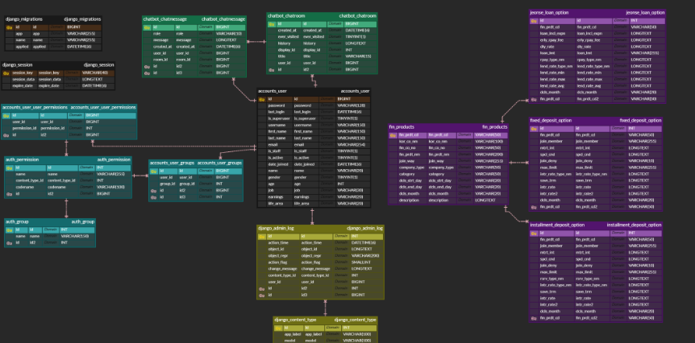

# FinBot

Finbot - 금융상품 검색·추천 AI 챗봇 서비스

# 목차

```plaintext
# 프로젝트 이름
## 1. 프로젝트 개요
## 2. 서비스 소개
## 3. 주요 기능
## 4. 실행 방법
## 5. 기술 스택
## 6. 시스템 아키텍쳐
## 7. 데이터 구조 (ERD)
## 8. 팀 기여도 및 역할
## 9. AI 모듈 설명
## 10. 개발 과정 정리
```

## 1. 프로젝트 개요

FinBot은 사용자가 복잡한 금융 상품 설명서를 직접 비교하지 않고도, **자연어로 질문만 하면 예금·적금·대출 상품을 찾아주고 계산까지 도와주는 AI 금융 챗봇 서비스**

사용자가 일상 언어로 질문하면 FinBot은 **RAG(Retrieval-Augmented Generation)** 기반 검색을 통해 금융 상품 DB에서 관련 상품을 찾아 추천

또한 추천된 금융 상품에 대해 **사용자의 상황(금액, 기간, 이자 유형 등)에 맞춰 예상 만기 금액, 이자 수익, 상환 금액 등 주요 지표를 계산해주는 기능**을 제공하여, 금융 지식이 많지 않은 사용자도 쉽게 상품을 이해하고 선택할 수 있도록 돕는 것이 목표

## 2. 서비스 소개

FinBot은 금융 상품 탐색 과정을 쉽게 만들기 위해 설계된 **AI 기반 금융 챗봇 서비스**

사용자는 별도의 금융 지식 없이도 챗봇에게 자연어로 질문하면, FinBot이 금융 상품 데이터베이스와 RAG 검색을 기반으로 가장 적합한 예금·적금·대출 상품을 찾아 추천

### FinBot이 제공하는 주요 서비스 흐름

1. **사용자 질문 입력**
    - “6개월짜리 고금리 예금 추천해줘”
    - “이 적금에 월 30만 원 넣으면 만기 금액이 얼마야?” 등 자연어 질문 지원
2. **RAG 기반 상품 검색 및 요약**
    - 금융상품 DB와 벡터 DB(Qdrant)를 활용해 관련 상품과 정보 문서를 검색
    - 상품의 핵심 조건, 금리, 특이사항을 이해하기 쉽게 요약 제공
4. **금융 계산 기능 제공**
    - 사용자가 입력한 금액·기간·이자 유형 등에 따라 **만기 수령액, 이자 수익, 상환 금액** 등을 자동 계산
    - 개인별 조건에 맞춘 빠른 의사결정 지원
5. **추천 상품 상세 정보 제공**
    - 기본 정보부터 금리 구조, 중도해지 규정, 부가 서비스까지
    필요한 정보를 정리해 한 페이지에서 확인 가능

FinBot은 단순 검색을 넘어, **금융 상품 추천 – 정보 요약 – 맞춤 계산 – 결정 지원**까지 하나의 흐름으로 제공하는 것이 목표

## 3. 주요 기능

FinBot은 금융상품 탐색, 비교, 계산 과정을 하나의 흐름으로 제공하는 AI 기반 서비스로 다음과 같은 기능을 제공

### 1) 챗봇 형태의 자연어 기반 금융상품 추천

- 예금·적금·대출 상품을 사용자 질문만으로 검색
- “고금리 예금 추천”, “1년 만기 적금 중 금리가 가장 높은 상품 알려줘” 등 일상 언어로 질의 가능
- RAG 검색을 통해 상품 DB와 관련 문서에서 가장 적합한 상품을 찾아 제시

### 2) 사용자 맞춤 금융 계산 기능

- 사용자가 입력한 조건(기간, 금액, 금리 유형 등)에 따라 자동 계산
    - 예적금 만기 금액
    - 이자 수익
    - 대출 상환 금액 및 이자 부담
- 상품별 조건을 반영한 실질적인 계산을 제공하여 실제 의사결정에 도움

### 3) 상품 북마크 기능

- 마음에 드는 금융상품을 **클릭 한 번으로 북마크**
- 북마크한 상품을 한 곳에서 모아서 다시 확인 가능
- 추천 결과 확인 → 상품 저장 → 계산/비교 과정으로 이어지는 탐색 흐름을 강화

### 4) 금융상품 검색 및 상세 정보 조회

- 메인 페이지에서 사용자의 검색어에 맞는 금융 상품 검색
- 추천된 상품의 상세 조건, 금리 구조, 우대요건 정리
- 복잡한 상품 설명서를 보기 쉬운 형태로 재구성
- 상품 비교 판단을 위한 핵심 정보 제공

## 4. 실행 방법
`추후 내용 추가`

## 5. 기술 스택


]


## 6. 시스템 아키텍쳐
`추후 내용 추가`

## 7. 데이터 구조 (ERD)


## 8. 팀 기여도 및 역할
### 백우성
### 🧭 PM
- 프로젝트 일정 관리 및 전체 개발 흐름 조율
- Git 브랜치 전략 수립과 PR 리뷰 프로세스 구축
- 협업 규칙 정립 (커밋 · 브랜치 네이밍 컨벤션, PR / Issue 템플릿 구성)
- 코드 품질 개선 환경 구축 (Ruff, 자동 포매팅, GitHub Actions CI 준비)

### 🛠️ DevOps
- AWS EC2 / Docker / Nginx / Gunicorn 기반 배포 환경 구축
- Docker · 배포 · Git 관련 기술 지원 및 문제 해결 담당

<br>

### 강태인
### 🤖 AI Engineer
- 금융 상품 데이터 수집, 구조 정의 및 전처리
- 금융 상품 데이터의 Vector DB 적재
- AI 채팅의 기능별 대화 로직 설계 및 구현
    - greeting / recommend / calculate / explain / normal / user feedback
- AI 채팅 로직 그래프 기반 시각화
- 객체 생성 최적화

<br>

### 김유나
### 📊 Database Engineer
- SQLite → MySQL 전환과 연결 및 마이그레이션 환경 구성
- 금융감독원 오픈API 데이터 수집 및 저장 파이프라인 개발
- ERD 기반 금융 상품 모델 정규화

### 🔧 Backend Developer
- 금융상품 저장 시 중복 방지 로직 구현
- 로그인 · 회원 탈퇴 등 사용자 인증 기능 구현
- 기본 챗봇 메시지 저장 모델과 채팅 페이지 기능 구현
- 사용자 이름 처리 로직 개선
- 메인 화면 금융상품 추천 로직 개발

<br>

### 김종민
### 🔧 Backend Developer
- 회원 도메인 핵심 기능 구현
    - 회원가입, 로그인, 비밀번호 변경, 개인정보 수정, 회원 탈퇴 시 비밀번호 재인증 로직 설계
    - Django auth / session 기반 인증 흐름 구성

- 금융상품 북마크 기능 개발
    - ManyToMany 기반 북마크 구조 설계 및 북마크 토글 기능 구현
    - 사용자별 북마크 리스트 조회 기능 구현

- 챗봇 채팅 기능 및 AI 모듈 연동
    - 채팅 페이지 구현
    - 사용자 입력 → AI 응답으로 이어지는 요청/응답 흐름 설계정의
    - 팀원 개발 모듈의 입출력 규격 분석 및 Django View 연동
    - 응답 가공 및 DB 저장 구조 정비

- 프론트엔드 협업 지원 (템플릿 데이터 구조 정리)

<br>

### 여희림
### 🔧 Backend Developer
- 사용자 관리 기능
    - 로그아웃, 회원 정보 수정 등 인증 · 세션 기반 기능 구현

- 금융상품 검색 기능
    - 상품명 / 은행명 기반의 부분 일치 검색 기능 구현
    - 검색 입력값 유지 및 목록 렌더링 처리

- 금융상품 상세 조회 기능
    - 상품 마스터 테이블과 옵션 테이블의 관계 기반 상세 정보 렌더링 구현
    - NULL / None 값 전처리

- 금융상품 북마크 기능 개발
    - ManyToOne 기반 북마크 구조 설계 및 구현
    - 관심 상품 리스트 페이지 구축

- 시스템 관리 기능
    - 세션 및 인증 관리 전반
    - Django Session Middleware 기반 세션 구조 분석 및 적용
    - 로그인 상태에 따른 접근 및 UI 노출 제어 등 전반적인 인증 로직 구성

- 프론트엔드 협업 지원 (페이지네이션과 알림 기능 구현)

<br>

### 박영운
### 🧭 Sub-PM
- 주요 기능 테스트 참여
- 프로젝트 일정 및 진행 상황 보조 관리 및 공유

### 💻 Frontend Developer
- 전체 서비스 페이지 UI 구현 및 반응형 레이아웃 구성
- HTML/CSS 기반 퍼블리싱 및 Django 템플릿 연동
- 화면 구조 개선, 오류 수정, UI 일관성 유지

### 🎨 UI/UX Designer
- 서비스 전반 디자인 구축 (색상, 타이포)
- Figma 기반 화면 설계 및 프로토타입 제작
- 메인 텍스트 로고 (FINBOT) 및 챗봇 캐릭터 로고 제작
### 🙍‍♂️ PM & 배포 (1명)

- **담당자: 백우성**
- **주요 역할:**
    - 프로젝트 일정 관리 및 전체 개발 흐름 조율
    - Git 브랜치 전략 수립과 PR 리뷰 프로세스 구축
    - 협업 규칙 정립(커밋 컨벤션, 브랜치 네이밍, PR/Issue 템플릿 마련)
    - 코드 품질 개선 환경 구축(Ruff 기반 코드 검사·자동 포매팅, GitHub Actions CI 준비)
    - 서비스 배포 환경 구축(AWS EC2, Docker, Nginx, Gunicorn)
    - 팀원들의 Docker·배포·Git 관련 기술 지원 및 문제 해결